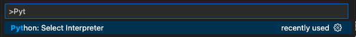

# Harmonic Jam

Welcome to the jam! :D Hopefully these instructions make your setup seamless! :star:

The backend repo will get you setup with a:

- FastAPI server
- Postgres DB

and some basic APIs to fetch a collection of companies.

# Resources

- [FastAPI](https://fastapi.tiangolo.com/)
- [SQLAlchemy](https://docs.sqlalchemy.org/en/20/intro.html)
- [Pydantic](https://docs.pydantic.dev/latest/)

# Setup

1. Make sure we are in the backend directory:
   ```bash
   pwd
   > fullstack-jam/backend
   ```
2. Ensure you have Python 3.9 installed (this repo was created with 3.9.16)
3. `poetry install` ([install poetry](https://python-poetry.org/docs/#installation) if you don't have it yet)
4. Followed by `docker compose up`
5. Navigate to http://localhost:8000/docs to see your FastAPI server.
6. (for dev) In VSCode, select your Python Interpreter (CMD+P) to use the poetry created environment:
   

   You can find the list of environments via: `poetry env list` and the currently active venv for poetry via: `poetry env info`

## Seeding Data

The database will automatically get seeded (see main.py) with:

- 100K companies
- List 1: 'My List' with 50k companies
- List 2: 'Liked Companies' with 10 companies

# Reset Docker Container

1. Run `docker compose down`
2. Run `docker volume rm backend_postgres_data`
3. Run `docker compose build --no-cache` to force rebuild
4. Followed by `docker compose up`
5. Navigate to http://localhost:8000/docs to see your FastAPI server.

## Accessing the DB

1. SSH into the postgres container: `docker exec -it {container_name} /bin/bash`. Run `docker ps` to get the dynamically generated {container_name} for the postgres image. Example: `docker exec -it backend_postgres-jam-db_1 /bin/bash`
2. Run `psql -U postgres harmonicjam` to open the Postgres interface.
3. Run `\dt` to list all tables and confirm you are connected.
4. Execute any SQL query: `SELECT * FROM companies;`

## Modifying Tables & Schema

Tables and schemas are dynamically loaded each time the FastAPI server loads up - see [here](main.py#L14).

- If we want to make changes to the schemas or add new tables, we can simply modify/add them [here](backend/db/database.py#L44) and restart the server (or hard reset if we want to re-seed the data).
